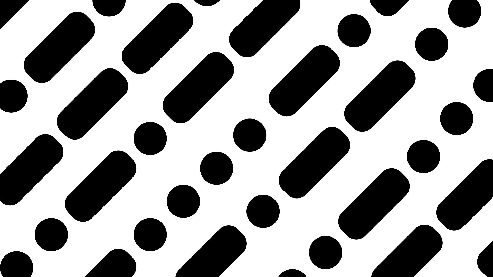
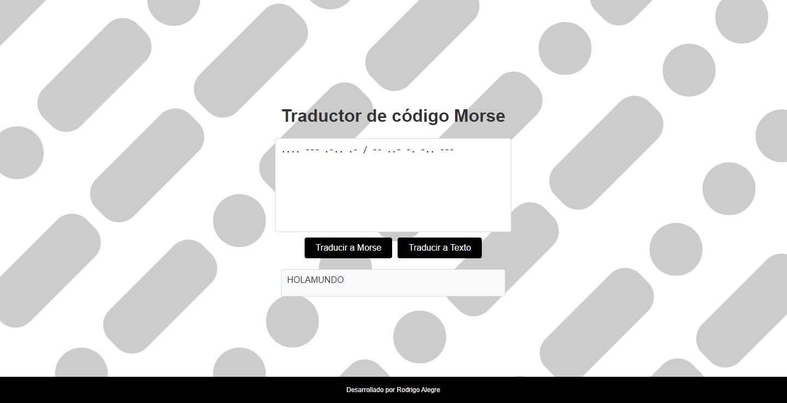

<h1 align="center"> Traductor Morse </h1>

Hace unas semanas, mientras jugaba a **"Dead Frontier 2"**, un videojuego de superviencia zombie de mundo abierto. En el juego, las misiones te llevan a explorar casas y mientras haces esto vas a encontrarte cofres con recompensas
como armas, ropa o armaduras. Estos cofres necesitan resolver puzzles, acertijos o traducciones, entre estas, traducir código Morse.

Recurría a páginas web para realizar dicha traducción, pero estas suelen ser poco amigables para el usuario, complicadas por los anuncios y una estructura poco intuitiva. Entonces decidí crear mi propia herramienta para traducir
código Morse. Si bien no es un proyecto imprescindible en el mundo actual, me pareció una excelente oportunidad para practicar y mejorar mis habilidades en frontend, un área en la que estoy empezando a trabajar.

## Tecnologías.
* **Backend**: Desarrollé la lógica de traducción y soporte de la página utilizando Python y Flask.
* **Frontend**: Creé un diseño sencillo pero atractivo utilizando HTML y CSS.
* **Diseño Gráfico**: Usé Canva para diseñar el fondo de la aplicación web, creando una estética agradable que complementa la funcionalidad de la herramienta.

Este proyecto fue creado con la intención de mejorar mis habilidades en frontend y ofrecer una herramienta más amigable para la traducción de código Morse. Si encuentran algún problema o tienen sugerencias de mejora, estoy encantado
de recubir sus consejos.

Muchas gracias por tomarte el tiempo de explorar mi trabajo.
